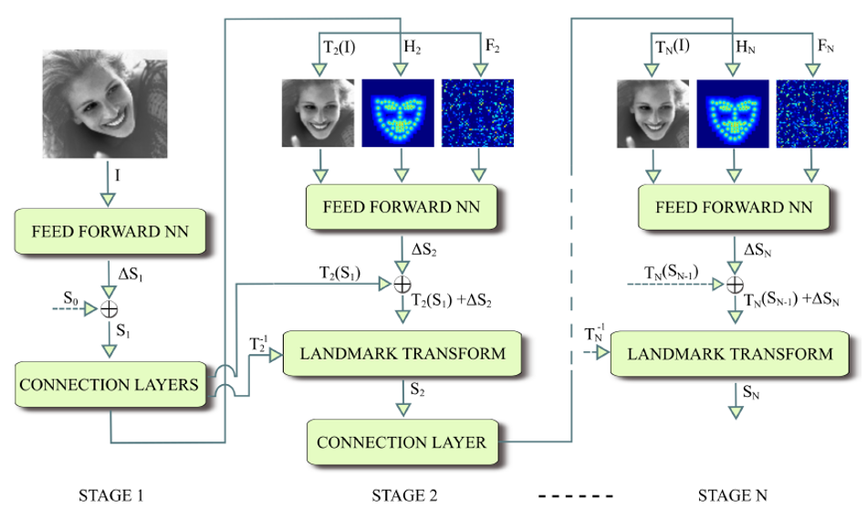
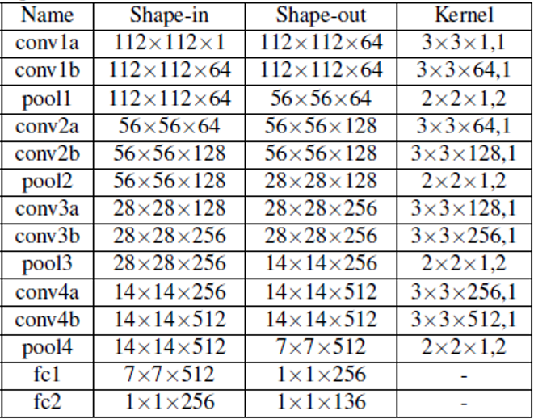

# Deep Alignment Network: A convolutional neural network for robust face alignment

This is a **Tensorflow** implementations of paper *"Deep Alignment Network: A convolutional neural network for robust face alignment"*.
You can see **Original implementation** [here](https://github.com/MarekKowalski/DeepAlignmentNetwork).

-----------------

### 0. [Requirements (and how to install dependecies)](#requirements)
### 1. [Explain algorithm of Deep Alignment Network](#deep-alignment-network)
### 2. [How to use](#how-to-use)
### 3. [Prediction errors on test-set (and pre-trained model)](#outputs)
#### **If there is something wrong, please correct it!!!**

-----------------

## Requirements
### System
* Intel Core i5-6600K CPU @ 3.5GHz
* 8.00GB RAM
* NVIDIA Gefore GTX 960
* Windows 10 64bit

### Getting started
First of all you need to install CUDA Toolkit and cuDNN. 
I recommend Anaconda 3, because it has all the neccessary libraries except for tensorflow and opencv.

* Anaconda 3 (Python 3.5.6) [download](https://www.anaconda.com/products/individual)
* CUDA v9.0.176 for Windows 10 (Sept. 2017) [download](https://developer.nvidia.com/cuda-toolkit-archive)
* cuDNN v7.0.5 for Windows 10 (Dec. 5, 2017) [download](https://developer.nvidia.com/rdp/cudnn-archive)
* Tensorflow 1.9.0
* OpenCV 4.2.0

Tensorflow and OpenCV can be installed with the following commands:
```shell
pip install --upgrade opencv-python
pip install --upgrade tensorflow-gpu==1.9.0
```

## Deep Alignment Network
<center></center>

The Deep Alignment Network(DAN) extracts features from the entire face image, while approaches based on Cascade Shape Regression(CSR) extract the patches around landmark locations.

### first stage
#### feed-forward neural network
<center></center>

* use batch normalization and ReLU (Rectified Linear Units) except for max pooling and output layer.
* add dropout before the first fully connected layer.
* until the validation error stops improving.

### second stage
#### normalization to canonical shape
* calculate affine transformation matrix (with rotation and translation) between averaged shape point and point of `first stage`.
* transform input image (with bilinear interpolation) and landmark output from feed-forward neural network by using affine transformation matrix.
#### landmark heatmap
* 1 / (reduce_mean(||(x, y) - s||) + 1.0)
* (x,y) : input image
* s : landmark transformed as shape of image
#### feature image layer
* made by first fully connected layer of feed-forward nn
* resize to half of image size
* upscale to image size
#### feed-forward neural network
* same as first stage

### loss function
* minimize the landmark location error normalized by the distance between the pupils.

## How to use
### How to prepare dataset

Download the 300W, LFPW, HELEN, AFW and IBUG datasets from [https://ibug.doc.ic.ac.uk/resources/facial-point-annotations/](https://ibug.doc.ic.ac.uk/resources/facial-point-annotations/) and extract them /DAN_V2/db/ into seperate directories: 300W, lfpw, helen, afw and ibug. Run the under script, it may take a while.
```shell
python split_trainset.py
python split_testset.py
```
Write mirror file on the same folder. There is a 68 landmark mirror file. [download](https://pan.baidu.com/s/1Ln_i00DRulDlgHJ8CmIqAQ)

In turn, run under script to make preprocess dataset.
```shell
python preprocessing.py --input_dir=./data/train --output_dir=./prep/train --istrain=True --repeat=10 --img_size=112 --mirror_file=./Mirror68.txt
python preprocessing.py --input_dir=./data/valid --output_dir=./prep/valid --istrain=False --img_size=112
python preprocessing.py --input_dir=./data/test/common_set --output_dir=./prep/test/common_set --istrain=False --img_size=112
python preprocessing.py --input_dir=./data/test/challenge_set --output_dir=./prep/test/challenge_set --istrain=False --img_size=112
python preprocessing.py --input_dir=./data/test/300w_private_set --output_dir=./prep/test/300w_private_set --istrain=False --img_size=112
```

### How to train model on 300W

In turn, run under script to train model of 300W dataset. 
```shell
python DAN_V2.py -ds 1 --data_dir=./prep/train --data_dir_test=./prep/valid -nlm 68 -te=15 -epe=1 -mode train
python DAN_V2.py -ds 2 --data_dir=./prep/train --data_dir_test=./prep/valid -nlm 68 -te=45 -epe=1 -mode train
```

### How to evaluate accuracy on 300W

Consequently execute following script and then copy the files in the folders (`./prep/predict/common_set`, `./prep/predict/challenge_set`, `./prep/predict/300w_private_set`) seperately.
```shell
python DAN_V2.py -ds 2 --data_dir=./prep/test/common_set --data_dir_test=None -nlm 68 -mode predict
python move_result.py ./prep/predict common_set
python DAN_V2.py -ds 2 --data_dir=./prep/test/challenge_set --data_dir_test=None -nlm 68 -mode predict
python move_result.py ./prep/predict challenge_set
python DAN_V2.py -ds 2 --data_dir=./prep/test/300w_private_set --data_dir_test=None -nlm 68 -mode predict
python move_result.py ./prep/predict 300w_private_set
```
For calculating the errors, execute the command:
```shell
python dan_predict.py
```

## Outputs
### Results of DAN on 300W dataset

Results of DAN on the 300W public test set and its subsets.
|Method|Common subset|Challenging subset|Full set|
|:---:|:---:|:---:|:---:|
|||inter-pupil normalization||
|Paper|4.42|7.57|5.03|
|Trained|5.09|9.38|5.93|
|||inter-ocular normalization||
|Paper|3.19|5.24|3.59|
|Trained|3.67|6.49|4.22|
|||bounding box diagonal normalization||
|Paper|1.35|2.00|1.48|
|Trained|1.54|2.49|1.73|

Results of DAN on the 300W public test set.
|Method|AUC 0.08|Failure (%)|
|:---:|:---:|:---:|
||inter-ocular normalization||
|Paper|55.33|1.16|
|Trained|48.04|4.35|

Results of DAN on the 300W private test set.
|Method|Mean error|AUC 0.08|Failure (%)|
|:---:|:---:|:---:|:---:|
|||inter-ocular normalization||
|Paper|4.30|47.00|2.67|
|Trained|5.18|36.84|6.00|


### Pre-trained Model

You can download pre-trained model [download](https://drive.google.com/drive/folders/1RY4g6_uSgJYY0qbCaqPpL_Ayp1xZHQpU?usp=sharing). This model trained on 300W dataset. Copy the file to `./model_dir`
